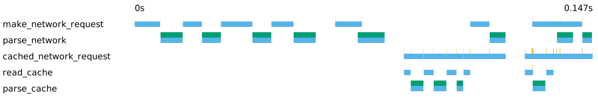
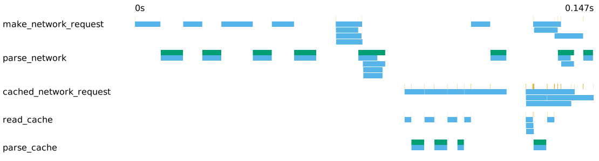

# tracing-durations-export

[](https://crates.io/crates/tracing-durations-export)
[](https://docs.rs/tracing-durations-export)

A tracing layer to figure out which tasks are running in parallel and which are blocked on cpu, mainly for cli applications.

Each span from beginning to end is a blue stripe. An async span can either be active or yield and wait ([details in the tracing docs](https://docs.rs/tracing/latest/tracing/struct.Span.html#in-asynchronous-code)), only in the sections in which a span is active, we plot an orange section above it. Sync spans are always active, so their blue and orange regions are identical. The darker the color the more spans of the same name are active at the same time.

The example plot below is generated by [cached_network.rs](examples/cached_network.rs) has four sections. The first show sequentially making network requests and parsing the response, the second section shows the same logic but parallelized with [buffer_unordered](https://docs.rs/futures/latest/futures/stream/trait.StreamExt.html#method.buffer_unordered). You can see how the requests happen in parallel and the parsing starts as soon as a request is finished. Sections three and four are a more complex example where we first check a cache before emitting a network request.



Open the svg in your browser and hover over the sections for detailed timings and field information.

The multi-lane option provides a more verbose view showing each individual span:



The plots are complementary to a cpu profiler such as `perf` or [sample](https://github.com/mstange/samply) and looking at raw span durations. They don't give you and exact work-by-line breakdown, instead they tell you where cpu is blocking or delaying other work and when the cpu is idle waiting for more parallelism.

## Usage

```rust
use std::fs::File;
use std::io::BufWriter;
use tracing_durations_export::DurationLayer;
use tracing_subscriber::layer::SubscriberExt;
use tracing_subscriber::{registry::Registry, fmt};

fn setup_global_subscriber() -> DurationsLayerDropGuard {
    let fmt_layer = fmt::Layer::default();
    let (duration_layer, guard) = DurationsLayerBuilder::default()
        .durations_file("traces.ndjson")
        // Available with the `plot` feature
        // .plot_file("traces.svg")
        .build()
        .unwrap();
    let subscriber = tracing_subscriber::registry()
        .with(fmt_layer)
        .with(duration_layer)
        .init();

    guard
}

// your code here ...
```

You can either use the `plot` feature and set `.plot_file()` on the builder, or after running your application, run

```shell
cargo run --bin plot --features plot --features cli -- traces.ndjson
```

and open `traces.svg`.

For the plots at the beginning of the readme:

```shell
TRACING_DURATION_EXPORT=examples/cached_network.ndjson cargo run --example cached_network
cargo run --bin plot --features plot --features cli -- examples/cached_network.ndjson
cargo run --bin plot --features plot --features cli -- --multi-lane examples/cached_network.ndjson --output examples/cached_network_multi_lane.svg
```

The `traces.ndjson` output file will look something like below, where each section where a span is active is one line.

```ndjson
[...]
{"id":6,"name":"read_cache","start":{"secs":0,"nanos":122457871},"end":{"secs":0,"nanos":122463135},"parents":[5],"fields":{"id":"2"}}
{"id":5,"name":"cached_network_request","start":{"secs":0,"nanos":122433854},"end":{"secs":0,"nanos":122499689},"parents":[],"fields":{"id":"2","api":"https://example.net/cached"}}
{"id":9007474132647937,"name":"parse_cache","start":{"secs":0,"nanos":122625724},"end":{"secs":0,"nanos":125791908},"parents":[],"fields":{}}
{"id":5,"name":"cached_network_request","start":{"secs":0,"nanos":125973025},"end":{"secs":0,"nanos":126007737},"parents":[],"fields":{"id":"2","api":"https://example.net/cached"}}
{"id":5,"name":"cached_network_request","start":{"secs":0,"nanos":126061739},"end":{"secs":0,"nanos":126066912},"parents":[],"fields":{"id":"2","api":"https://example.net/cached"}}
{"id":2251799813685254,"name":"read_cache","start":{"secs":0,"nanos":126157156},"end":{"secs":0,"nanos":126193547},"parents":[2251799813685253],"fields":{"id":"3"}}
{"id":2251799813685253,"name":"cached_network_request","start":{"secs":0,"nanos":126144140},"end":{"secs":0,"nanos":126213181},"parents":[],"fields":{"api":"https://example.net/cached","id":"3"}}
{"id":27021597764222977,"name":"make_network_request","start":{"secs":0,"nanos":128343009},"end":{"secs":0,"nanos":128383121},"parents":[13510798882111491],"fields":{"api":"https://example.net/cached","id":"0"}}```
[...]
```

Note that 0 is the time of the first span, not the start of the process.

## Case Study

This is an example from the dependency resolver [uv](https://github.com/astral-sh/uv). We make a guess about what versions fit the user's constraints, and then has to fetch the metadata for them to check if those versions are compatible. In this particular case, we have to try a lot of versions for two packages called `boto3` and `botocoro`. Previously, trying would happen sequentially:


We can optimize this by speculating: We make a guess about what versions could fit and also what version we would try next if that didn't work out, and fetch in parallel ([Pull request](https://github.com/astral-sh/uv/pull/2452)):


This is faster, but you can see we're having phases of a lot of parallelism with sequential regions in between. Hovering over the spans in the svg version in a browser, we could see that we were only prefetching `boto3` in parallel, but not `botocore`. With a fix that prefetches both:


Now we're taking 2s instead of 43s, so the initial section expanded, but what you can mainly see is that we're highly parallel now.

Another case study is [this pull request](https://github.com/astral-sh/uv/pull/1163), where we replaced a sync channel with an async channel, and the yielding would unlock parallelism. You can also see the impact of `spawn_blocking` there.
